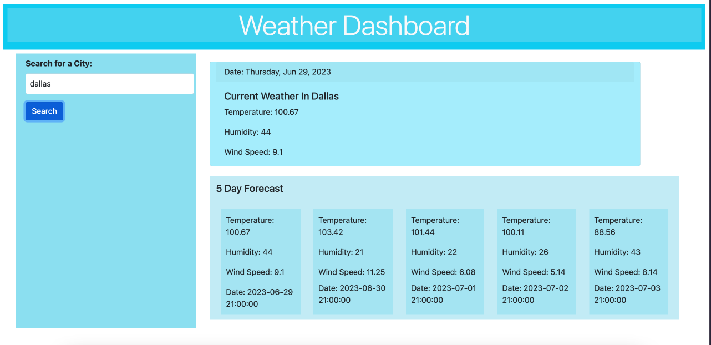

# Weather App

- [Usage](#usage)

- [Contributors](#contributors)

- [Questions](#questions)

## Description

This is a weather app that will help people find the weather information for their desired location.

[Repo page](https://github.com/Halimaxo/weather-app)

[Deployed page](https://halimaxo.github.io/weather-app/)

## Usage

To look at weather patterns/predictions.

## Contributors

Had help from my wonderful tutor Abdullah Al-Hilfi

## Questions

For further questions reach out to me using my GitHub Profile or email:
Halimaxo
